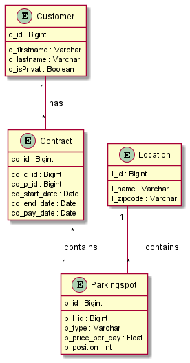
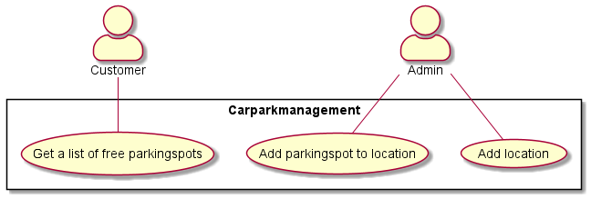

# kaufmann-carparkmanagement project

## Description
With this application it should be possible to manage car parks for private customers i.e.  "garage cities" or commercial customers for example shopping malls.





**Get list of free parkingspots:**
    It is possible for the customer to get a list of all parkingspots that are currently not rented.

**Add parkingspot to location:**
    It is possible that a admin can add parkingspots to an already existent location.

**Add parkingspot to location:**
    It is possible that an admin can create a location for the customer.

## Running the application in dev mode

This project uses Quarkus, the Supersonic Subatomic Java Framework.

If you want to learn more about Quarkus, please visit its website: https://quarkus.io/ .

First you need to start the database:
```shell script
docker run --ulimit memlock=-1:-1 -it --rm=true --memory-swappiness=0 --name postgres-db -e POSTGRES_USER=app -e POSTGRES_PASSWORD=app -e POSTGRES_DB=db -p 5432:5432 postgres:12.4
```


You can run your application in dev mode that enables live coding using:
```shell script
./mvnw clean compile quarkus:dev
```
Please only test with IDE option ``` Run all Tests ```.
If you intend to test the application please use the ``` Run all Tests ``` option, if run otherwise tests might fail.
If tested with  ``` mvnw clean compile test ``` it will fail due to tests being in another order.
## Packaging and running the application

The application can be packaged using:
```shell script
./mvnw package
```
It produces the `kaufmann-carparkmanagement-1.0.0-SNAPSHOT-runner.jar` file in the `/target` directory.
Be aware that it’s not an _über-jar_ as the dependencies are copied into the `target/lib` directory.

If you want to build an _über-jar_, execute the following command:
```shell script
./mvnw package -Dquarkus.package.type=uber-jar
```

The application is now runnable using `java -jar target/kaufmann-carparkmanagement-1.0.0-SNAPSHOT-runner.jar`.

## Creating a native executable

You can create a native executable using: 
```shell script
./mvnw package -Pnative
```

Or, if you don't have GraalVM installed, you can run the native executable build in a container using: 
```shell script
./mvnw package -Pnative -Dquarkus.native.container-build=true
```

You can then execute your native executable with: `./target/kaufmann-carparkmanagement-1.0.0-SNAPSHOT-runner`

If you want to learn more about building native executables, please consult https://quarkus.io/guides/maven-tooling.html.
